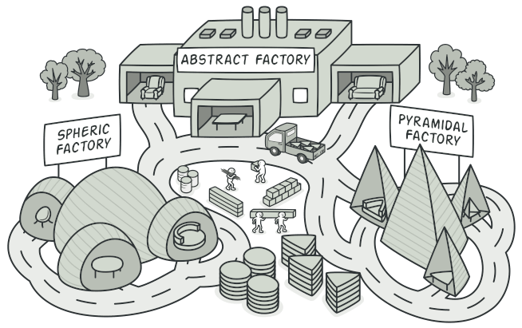
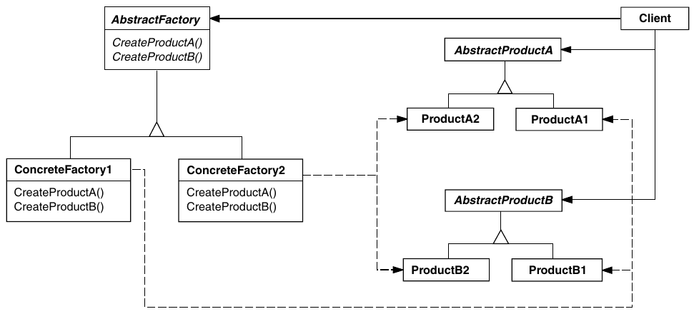

# Abstract Factory

> Intent: It's a creational design pattern that lets you produce families of related objects without specifying their concrete classes.

  

## When to use Abstract Facotry Pattern?

* A system must be independent of how it's are created, composed or represented;
* A system must be configured as product of a multi-product family;
* A family of product-objects is designed to be used, and you need to enforce this constraint;
* Only show the interface, not the implementation;

## UML Diagram

  

## Classes

* *AbstractFactory*
  * Declare an interface for operations that create abstract product-objects
* *Concrete Factory*
  * Implement operations that create concrete product-objects
* *AbstractProduct*
  * Declare an interface for a product-object type
* *ConcreteProduct*
  * Defines a product-objetc to be created by the corresponding concrete factory
  * Implements *Abstract Product* interface
* *Client*
  * Uses only interfaces declared by the *Abstract Factory* and *Abstract Product* classes
  
## How to implement the Abstract Factory Pattern?

1. Map out a matrix of distinct product types versus variants of these products.

2. Declare abstract product interfaces for all product types. Then make all concrete product classes implement these interfaces.

3. Declare the abstract factory interface with a set of creation methods for all abstract products.

4. Implement a set of concrete factory classes, one for each product variant.

5. Create factory initialization code somewhere in the app. It should instantiate one of the concrete factory classes, depending on the application configuration or the current environment. Pass this factory object to all classes that construct products.

6. Scan through the code and find all direct calls to product constructors. Replace them with calls to the appropriate creation method on the factory object.

| Pros | Const |
|:-:|:-:|
|✅ You can be sure that the products you’re getting from a factory are compatible with each other.|❌ The code may become more complicated than it should be, since a lot of new interfaces and classes are introduced along with the pattern.|
|✅ You avoid tight coupling between concrete products and client code.|
|✅ Single Responsibility Principle. You can extract the product creation code into one place, making the code easier to support.|
|✅ Open/Closed Principle. You can introduce new variants of products without breaking existing client code.|

