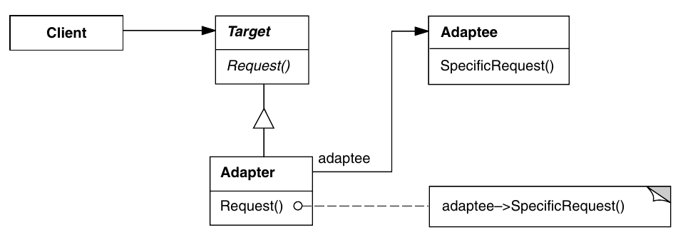
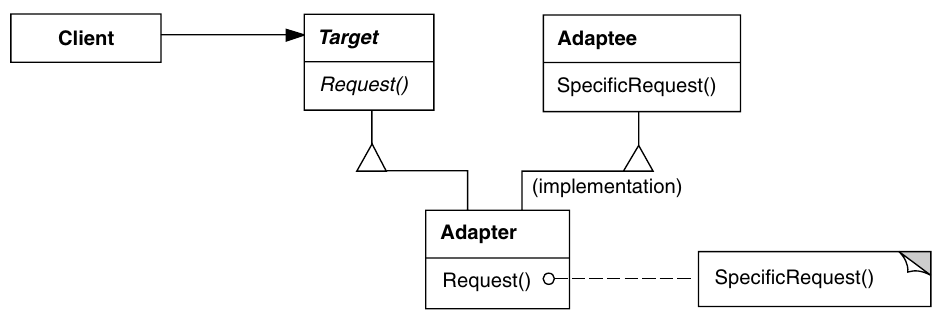

# Adapter

> Itent: Concerned with maintaining flexible and efficient structure

## When to use Adaptre Pattern?

- Use when we have a class whose interface is not compatible with the rest of the code
- Use when we want to reuse many subclasses with common functionality, which cannot be added to the superclass
- Use when you need to use multiple subclasses existing, however it is impractical to create an interface for each subclass

## Purpose

- Gives a unified interface that allows objects with incompatible interfaces to collaborate
- Converts an object's interface so that another object can understand it

## How does the Adapter Pattern Work?

1. The adapter gains an interface compatible with one of the objects
2. Using interface, object can safely call method inside adapter
3. When called, passes the request to the second object in a way that it will understand

## UML Diagram (Composition)

## UML Diagram (Inheritance)

## Classes

- *Target*
  - Defines the domain-specific interface that *Client* uses
- *Client*
  - Collaborates with objects compatible with the Target interface
- *Adaptee*
  - Defines an existing interface that needs to be adapted
- *Adpter*
  - Adapts the *Adaptee*'s interface to the *Target*'s interface

| Pros | Const |
|:-:|:-:|
|✅ Principle of Single Responsibility.|❌ Increased code complexity with the introduction of new interfaces.|
|✅ Possibility of multiple adapters without breaking the client interface.|
