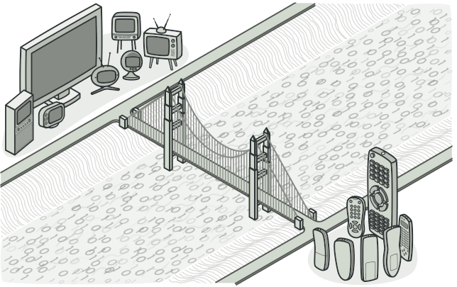
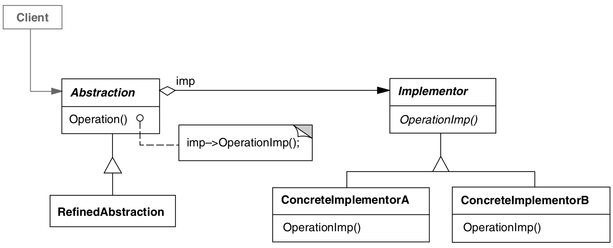

# Bridge

> Pattern that allows for large classes or a closely related set in two separate hierarchies, which can separate separate classes independently

    

## UML Diagram

## Classes

- *Abstraction*
  - Provides a high-level interface that will give functions to concrete classes
- *Implementation*
  - Declares an interface that is common to all concrete classes. Abstraction communicates with it through the methods
- *Concrete class*
  - Contains specific code
- *Refined Abstractions*
  - Gives more variants of logic control
- *Client*
  - It is only interested in abstraction. Through it there is the link between Abstraction and Implementation

## When to use the Bridge Pattern?

- Want to split and organize a monolithic class that will have some variants in the functions
- If the class gets too big it's hard to abstract
- Use when we want to extend a class in multiple orthogonal dimensions
- Extract and separate class hierarchies into dimensions
- When we need to switch implementation at runtime

## How to implement the Bridge Pattern?

1. Identify orthogonal dimensions in classes

2. Define customer operations in Abstraction

3. Determine all operations for all platforms ⇒ Declare the ones Abstraction needs in the overall implementation of the interface

4. Create a concrete class for all platforms in the dimensions

5. Add reference to Implement

6. Create fine-grained abstractions for the abstraction base classes

7. The client code must pass an implementation object to the abstraction's constructor to associate one with the other. After that, the client can forget about the implementation and just work with the abstraction object.

| Pros | Const |
|:-:|:-:|
|✅ Create independent platforms between classes.|❌ The code will get more complicated by applying this pattern to cohesive classes.|
|✅ Client is not exposed to details ⇒ Sees only the abstraction.|
|✅Single Responsibility Principle is maintained|
