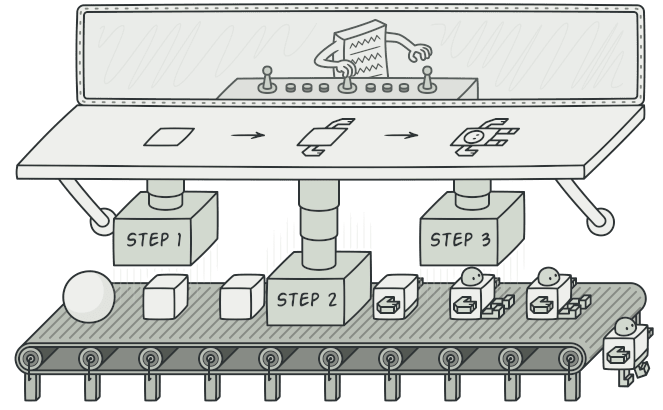
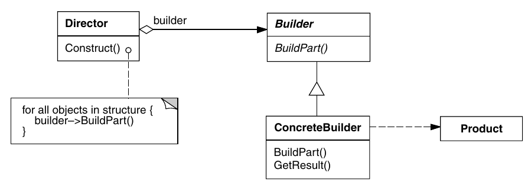

# Builder

> Intent: Creational design pattern that lets you construct complex objects step by step. The pattern allows you to produce different types and representations of an object using the same construction code.

    

## When to use the Builder Pattern?

* The algorithm for creating a complex object must be independent of the parts that make up the object and how they are assembled.
* The construction process must allow different representations for the object that is constructed.

## UML Diagram

    

## Classes

* *Builder*
  * Specifies an abstract interface for creating parts of a product object.

* *ConcreteBuilder*
  * Builds and assembles parts of the product by implementing the Builder interface
  * Defines and maintains the representation it creates
  * Provides an interface for product recovery
* *Director*
  * Builds an object using the Builder interface
* *Product*
  * Represents the complex object under construction. ConcreteBuilder builds the internal representation of the product and defines the process by which it is assembled;
  * Includes classes that define the constituent parts, including the interfaces for assembling the parts into the final result.

## How to implement?

1. Make sure that you can clearly define the common construction steps for building all available product representations. Otherwise, you won’t be able to proceed with implementing the pattern.

2. Declare these steps in the base builder interface.

3. Create a concrete builder class for each of the product representations and implement their construction steps.

4. Don’t forget about implementing a method for fetching the result of the construction. The reason why this method can’t be declared inside the builder interface is that various builders may construct products that don’t have a common interface. Therefore, you don’t know what would be the return type for such a method. However, if you’re dealing with products from a single hierarchy, the fetching method can be safely added to the base interface.

5. Think about creating a director class. It may encapsulate various ways to construct a product using the same builder object.

6. The client code creates both the builder and the director objects. Before construction starts, the client must pass a builder object to the director. Usually, the client does this only once, via parameters of the director’s class constructor. The director uses the builder object in all further construction. There’s an alternative approach, where the builder is passed to a specific product construction method of the director.

7. The construction result can be obtained directly from the director only if all products follow the same interface. Otherwise, the client should fetch the result from the builder.

| Pros | Const |
|:-:|:-:|
|✅ You can construct objects step-by-step, defer construction steps or run steps recursively.|❌ The overall complexity of the code increases since the pattern requires creating multiple new classes.|
|✅ You can reuse the same construction code when building various representations of products.|
|✅ Single Responsibility Principle. You can isolate complex construction code from the business logic of the product.|
